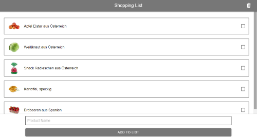
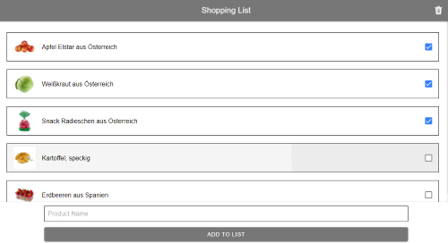
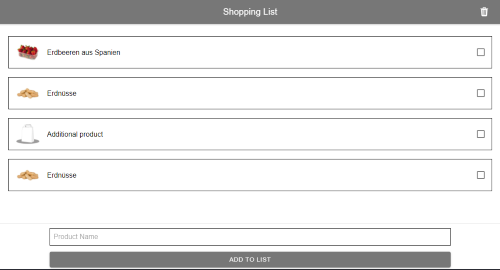

# Shopping Lister

*Angular and Ionic shopping app for mobile devices.*


## Application Desing

### *Initial View*


Initial view of the app, products get loaded from a json file.

### *Selecting A Product*


Selecting a product has a fast kind of loader animation, also, the selected products are shown on screen.

### *Deleted And Added Products*


After the deleting and adding some products, the application is shown as on screen.


## Other remarks

### How to start and build the project

- run ```npm install``` to install the necessary dependencies
- run ```ionic serve``` to start the app in your browser

### Developing in Android

- download and install **Android Studio**
- install the **Android SDK**
- set the *ANDROID_SDK_ROOT* enviroment variable: `export ANDROID_SDK_ROOT=$HOME/Library/Android/sdk`
- set the Android SDK command-line directories to PATH:
```# avdmanager, sdkmanager
export PATH=$PATH:$ANDROID_SDK_ROOT/tools/bin

# adb, logcat
export PATH=$PATH:$ANDROID_SDK_ROOT/platform-tools

# emulator
export PATH=$PATH:$ANDROID_SDK_ROOT/emulator
```
- create an **Android Virtual Device**

- generate the project with the command `ionic capacitor add android`
- set the **Package ID**
- run the device with the command `ionic capacitor copy android`
- in Android Studio hit the Run button and select the device